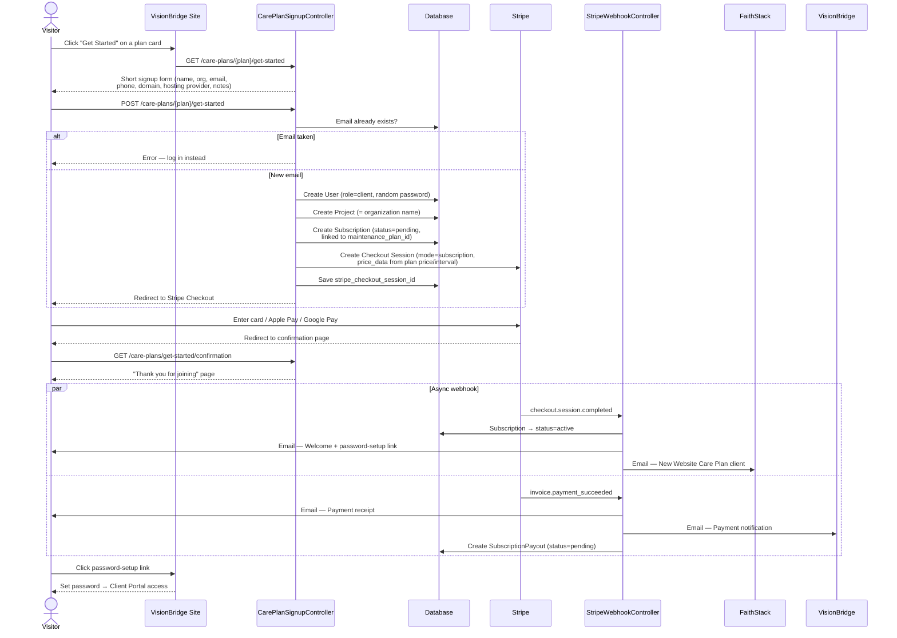
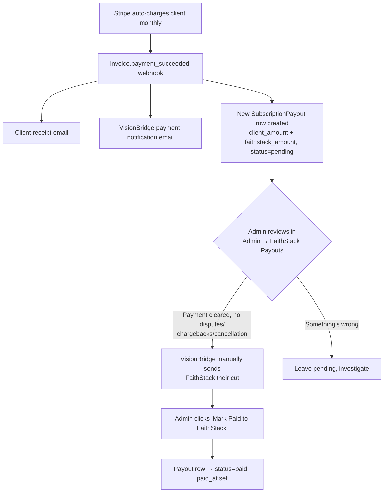

# Website Care Plan Subscription Flow

How a visitor turns into a paying, onboarded Website Care Plan client — and how
FaithStack's recurring compensation gets tracked and paid.

## 1. Signup → Payment → Onboarding

## 2. Monthly Billing & FaithStack Payout

Every billing cycle repeats the bottom half of the flow above — Stripe auto-charges,
the webhook fires `invoice.payment_succeeded`, and a new payout row is created.
What happens to that row is manual by design (see "Why" below):

**Why manual, not automated:** protects both parties from chargebacks/failed
payments, avoids extra Stripe transfer fees, and gives financial oversight while
the client base is still small. Can be revisited once billing volume is stable.

**Update:** the verification step itself is now automated. Each payout starts
`pending`, and a daily scheduled command (`payouts:verify`) promotes it to
`ready` once 7 clean days have passed. If Stripe reports a refund
(`charge.refunded`) or chargeback (`charge.dispute.created`) on that invoice
before then, the payout is automatically flipped to `flagged` instead and
VisionBridge gets an alert email — no payout is released without a human
clicking "Mark Paid to FaithStack" (or, for a flagged one, an explicit
"Send Anyway" override). The actual money movement to FaithStack is still
manual either way, since **Stripe can't pay out to the Philippines** (see
below) — automating that part requires a separate provider like Wise, Xendit,
or PayMongo, which hasn't been decided on yet.

## 3. Where things live

| Step | Code |
|---|---|
| Signup form + checkout creation | `app/Http/Controllers/CarePlanSignupController.php` |
| Confirmation page | same controller, `confirmation()` |
| Webhook handling (activation, emails, payout row) | `app/Http/Controllers/StripeWebhookController.php` |
| Plan tiers + FaithStack compensation per tier | `app/Models/MaintenancePlan.php` (`faithstack_compensation`) |
| Per-client subscription + signup details | `app/Models/Subscription.php` (`domain`, `hosting_provider`, `client_phone`, `notes`) |
| Per-cycle payout tracking | `app/Models/SubscriptionPayout.php` |
| Daily 7-day auto-verification | `app/Console/Commands/VerifyCarePlanPayouts.php` (scheduled in `routes/console.php`) |
| Dispute/refund holds | `StripeWebhookController::flagPayoutForInvoice()` / `flagPayoutForDispute()` |
| Admin "mark paid" UI | `resources/views/admin/subscription-payouts/index.blade.php` |
| Client welcome email | `app/Mail/WelcomeClientMail.php` |
| FaithStack new-client email | `app/Mail/FaithStackNewClientMail.php` |

## 4. Known limitation

If a visitor abandons Stripe Checkout, the `User` + `Project` + pending
`Subscription` created at form-submit time are **not** cleaned up automatically.
This matches the flow as specified; revisit if abandoned signups start piling up.

## 5. Real Stripe Price IDs (2026-07-06)

Both checkout paths (`CarePlanSignupController::store` and
`Portal\SubscriptionController::confirm`, used when an existing client starts a
plan from inside the portal) originally built a brand-new Stripe Product +
inline `price_data` on every single checkout — dollar amounts matched the
boss's real Stripe Products by coincidence (our seeded price = his price), but
never actually referenced his Product/Price catalog. Fixed ahead of launch:

- `maintenance_plans.stripe_price_id` (nullable string) holds the real
  `price_...` ID from the boss's Stripe dashboard, set per-tier in
  `MaintenancePlanSeeder` and editable from the admin Care Plan Pricing page.
- Both checkout paths now check `$maintenancePlan->stripe_price_id` first and
  pass `'price' => $stripePriceId` directly if set. They only fall back to the
  old ad-hoc `price_data` construction when it's blank — this keeps
  admin-created custom one-off subscriptions (`Admin\SubscriptionController::store`,
  which has no `maintenance_plan_id` at all) working exactly as before, since
  those were never tied to a fixed Care Plan tier in the first place.
- Live Price IDs currently on file: Essential `price_1Tpbh5IDvdvf6G8fqsFPevyQ`,
  Growth `price_1TpbnNIDvdvf6G8f235N3gah`, Elite `price_1TpbqDIDvdvf6G8fAaHKMPSA`.
