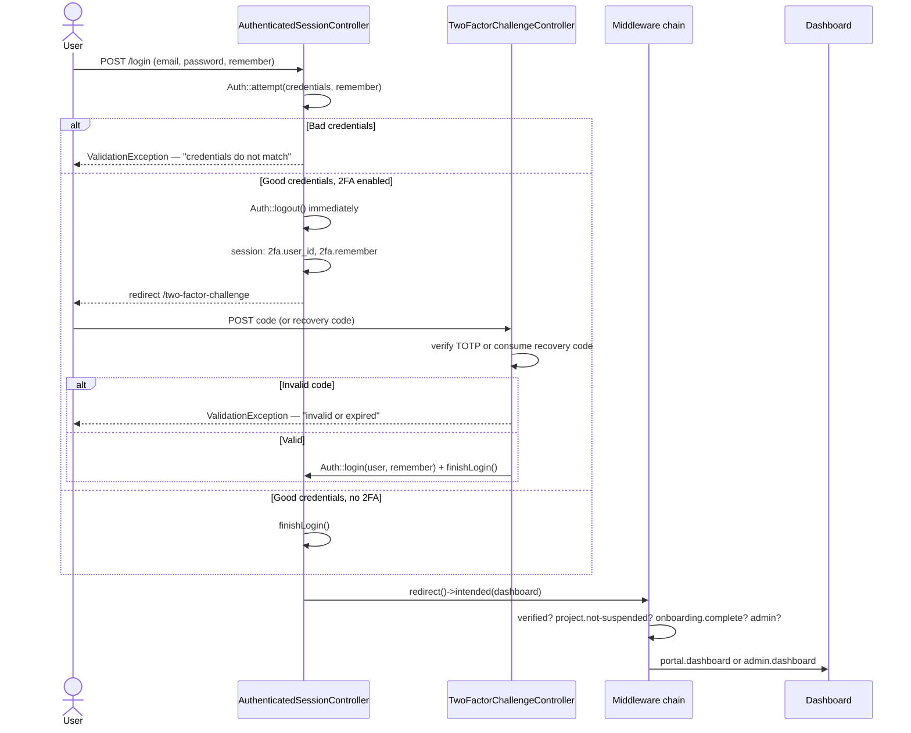

# Login Flow

How a user actually gets from the login form into the portal or admin
dashboard — credential check, optional 2FA challenge, and the middleware gate
chain that decides where they land. For 2FA enrollment specifically, see
[TWO_FACTOR_AUTHENTICATION.md](../TWO_FACTOR_AUTHENTICATION.md) — this doc
covers the login-time challenge only.

## 1. Overview



## 2. Sign-In (`AuthenticatedSessionController`)

`store()`:
1. Validates `email` + `password`.
2. `Auth::attempt($credentials, $remember)` — fails → `ValidationException`
   with a deliberately generic message ("credentials do not match our
   records"), not "wrong password" vs "no such user", to avoid leaking which
   emails have accounts.
3. **If the user has 2FA confirmed** (`hasTwoFactorEnabled()`): the session is
   never allowed to hold a fully-authenticated user until the code checks out.
   `Auth::logout()` runs *immediately* (even though `Auth::attempt()` just
   logged them in) — the user id and the `remember` flag are stashed in the
   session (`2fa.user_id`, `2fa.remember`), and the request is redirected to
   `/two-factor-challenge` instead of completing login.
4. **If no 2FA**: goes straight to `finishLogin()`.

## 3. Two-Factor Challenge (`TwoFactorChallengeController`)

Only reachable mid-login — `create()` bounces straight back to `/login` if
there's no pending `2fa.user_id` in session (i.e. someone can't hit this page
cold).

`store()`:
1. Validates the submitted `code`.
2. Accepts either a valid TOTP code (`TwoFactorAuthenticator::verify()`) **or**
   a one-time recovery code (`$user->consumeTwoFactorRecoveryCode($code)` —
   burns it on use).
3. Invalid → `ValidationException` ("invalid or has expired"), throttled at
   the route level (`throttle:6,1`).
4. Valid → pulls the stashed `remember` flag, forgets the pending session key,
   `Auth::login($user, $remember)`, then calls the **same**
   `AuthenticatedSessionController::finishLogin()` used by the no-2FA path —
   so both paths converge on identical post-login behavior.

## 4. `finishLogin()` — Shared Post-Auth Step

Static helper on `AuthenticatedSessionController`, called by both the direct
login path and the 2FA challenge path:

1. `$request->session()->regenerate()` — new session ID, standard
   session-fixation protection.
2. Logs a `LoginActivity` row (`user_id`, `ip_address`, `user_agent`,
   `logged_in_at`) — every successful login, 2FA or not, gets one row.
3. Non-admins get `show_payment_reminder` set in session — surfaces the
   "something's still owed" popup elsewhere in the portal if applicable.
4. Redirects: `redirect()->intended($destination)` where `$destination` is
   `admin.dashboard` for admins or `portal.dashboard` for clients —
   `intended()` still honors wherever they were trying to go before being
   bounced to login (e.g. a bookmarked deep link), falling back to the
   role-appropriate dashboard if there was no prior intended URL.

## 5. Registration → Immediate Auto-Login

`RegisteredUserController::store()`:
1. Validates name/email/password (`Rules\Password::defaults()` — 8+ chars,
   upper, lower, number, same policy as reset/account-settings).
2. Creates the `User` (`role: client`), fires Laravel's `Registered` event
   (queues the framework's own verification-notification listener).
3. Creates a starter `Project` (`"{name}'s Website"`) immediately — every
   client always has exactly one project from the moment they register.
4. Emails `support@` (`NewClientRegistrationMail`), sends the email
   verification notice.
5. **Logs the user in immediately** (`Auth::login($user)`) even though their
   email isn't verified yet — they land on `verification.notice`, not back at
   the login form. This is a deliberate UX choice: they're inside an
   authenticated session from the first second, just gated by the `verified`
   middleware until they click the emailed link.

## 6. Already-Logged-In Users Hitting `/login` or `/register`

Registered globally in `AppServiceProvider::boot()`:

```php
RedirectIfAuthenticated::redirectUsing(fn ($request) =>
    $request->user()->isAdmin() ? route('admin.dashboard') : route('portal.dashboard')
);
```

This overrides Laravel's stock `guest` middleware behavior (which by default
tries to redirect to a `dashboard` named route that doesn't exist in this
app) so an already-authenticated user hitting any `guest`-only route
(`/login`, `/register`, `/forgot-password`, `/reset-password/{token}`) gets
sent straight to their own dashboard instead of a broken redirect or the
public homepage.

## 7. Post-Login Middleware Gate Chain

Applied per route group in `routes/web.php`, in this order for portal routes:

| Middleware | Alias | What it checks |
|---|---|---|
| `auth` | (framework) | Must have a logged-in session at all. |
| `verified` | (framework) | `email_verified_at` must be set — otherwise redirected to `verification.notice`. |
| `project.not-suspended` | `EnsureProjectNotSuspended` | Blocks **all** portal routes if the client's project is suspended for an overdue Care Plan payment — except `portal.suspended` itself and the routes needed to actually pay out of it (`portal.billing.show`, `portal.subscriptions.update-payment-method`/`checkout`/`confirm`/`refresh`). Admins exempt. Runs *before* the onboarding gate so a suspended client is never bounced into an onboarding step instead of the suspension notice. |
| `onboarding.complete` | `EnsureOnboardingComplete` | Gates behind the 13-step onboarding sequence (`users.onboarding_step`) — redirects to whichever step is incomplete: questionnaire (`< 6`) → website type (`< 7`) → care plan (`< 8`) → agreement summary (`< 10`) → sign agreement (`< 13`). Admins exempt. |
| `admin` | `EnsureUserIsAdmin` | `abort(403)` unless `$user->isAdmin()` — wraps the entire `/admin` route group. |

A separate, smaller middleware group (`auth`, `verified` only — no
suspension/onboarding gate) covers routes that must stay reachable
*regardless* of onboarding progress: the onboarding step pages themselves,
the notification bell's mark-read endpoint, and the tour-complete endpoint
(both render on every portal page including onboarding pages, via
`layouts.portal`).

`UpdateLastSeen` is appended globally to the whole `web` middleware group
(not route-specific) — updates `users.last_seen_at` at most once per minute
per request (throttled via a timestamp check, not a queue), using
`saveQuietly()` so it doesn't fire model observers/events for what's just a
presence ping.

## 8. Forgot Password / Reset

Standard Laravel password broker, unchanged from framework defaults except
password complexity: `PasswordResetLinkController` emails a signed reset
link; `NewPasswordController` validates the token and enforces the same
`Rules\Password::defaults()` policy (8+ chars, upper, lower, number) used at
registration and in portal/admin account settings.

## 9. Logout

`AuthenticatedSessionController::destroy()` — `Auth::guard('web')->logout()`,
invalidates the session, regenerates the CSRF token, redirects to `/login`.

## 10. Known Behaviors / Notes

- **2FA is optional, per-user** — most users have no `two_factor_secret` set,
  so `hasTwoFactorEnabled()` is `false` and they never see the challenge page
  at all. See `TWO_FACTOR_AUTHENTICATION.md` for enrollment.
- **No "remember this device" for 2FA** — a 2FA-enabled user is challenged
  for a code on *every* login, even from a previously-trusted browser; only
  the underlying session's remember-me cookie (extends the session itself)
  is supported, not a 2FA-specific trust window.
- **Login activity has no admin-facing viewer yet** — `LoginActivity` rows
  are recorded on every login but there's no dedicated admin page listing
  them; the Admin Client List's "last-seen" column comes from
  `users.last_seen_at` (via `UpdateLastSeen`), not from `LoginActivity`.
- **Generic credential-failure message** is intentional (see §2) — don't
  "improve" it to distinguish "no such user" from "wrong password" without
  discussing the security tradeoff first.
