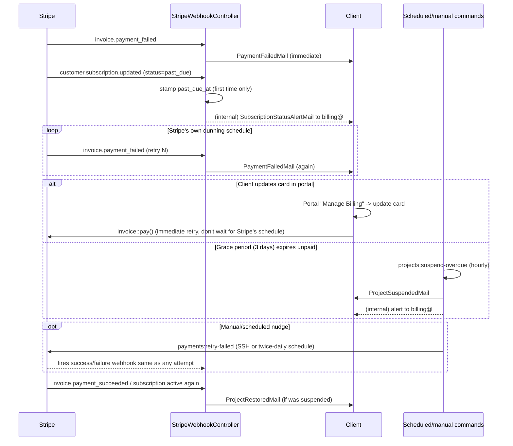

# Payment Flow

How money actually moves through VisionBridge Solutions — one-time payments,
recurring Website Care Plans, Stripe webhooks, and the failed-payment recovery
loop. For the client-signup-to-onboarding sequence specifically (new visitor →
paying Care Plan client), see
[CARE_PLAN_SUBSCRIPTION_FLOW.md](CARE_PLAN_SUBSCRIPTION_FLOW.md) — this doc
covers the payment mechanics broadly, across both one-time and recurring
money.

## 1. Two Kinds of Payment

| | One-time (`Payment`) | Recurring (`Subscription`) |
|---|---|---|
| Used for | Project deposit (50%), final payment (50%), custom "invoice" requests | Monthly Website Care Plan (Essential/Growth/Elite) |
| Created by | `Admin\ProjectController` (deposit, on first price set) / `Admin\PaymentController::store` (custom) | `CarePlanSignupController` (public signup) / `Portal\SubscriptionController::confirm` (portal) / `Admin\SubscriptionController::store` (admin custom) |
| Stripe object | `PaymentIntent` | `Subscription` + recurring `Invoice`s |
| Checkout UI | `resources/views/portal/payment-checkout.blade.php` (Stripe Elements, embedded) | `resources/views/portal/subscription-checkout.blade.php` (Stripe Elements, embedded) or Stripe Checkout Session (public pre-account signup only) |

Both flows are **branded and embedded** — card details go straight to Stripe,
but the client never leaves the VisionBridge portal UI (except the public
pre-account Care Plan signup, which still uses a Stripe-hosted Checkout
Session since there's no portal to embed into yet at that point).

## 2. One-Time Payments

1. A `Payment` row is created with `status = pending` — either automatically
   (the first deposit, the moment `Admin\ProjectController` sets a project's
   `total_price`) or manually (`Admin\PaymentController::store`, a custom
   "invoice" — see §6).
2. Client visits `/portal/payments/{payment}/checkout` — `Portal\PaymentController::checkout`
   creates a Stripe `PaymentIntent` directly (saved to `Payment::stripe_payment_intent_id`
   *before* confirmation) and renders Stripe Elements.
3. `stripe.confirmPayment()` runs client-side. Stripe's `payment_intent.succeeded`
   webhook is the source of truth — `StripeWebhookController::handlePaymentIntentSucceeded()`
   marks the payment `paid`, fetches the receipt URL, emails
   `PaymentReceiptMail`, notifies `billing@` (`AdminPaymentNotificationMail`),
   logs a `PartnerPayout` row, and checks `maybeAutoLaunchProject()` (a
   `final`-kind payment that's paid + deposit already paid + client approved
   the site auto-launches the project).

## 3. Recurring Website Care Plans

Three checkout entry points, same underlying `Subscription` model:

- **Public pre-account signup** (`CarePlanSignupController::store`) — a
  visitor with no account picks a plan, fills a short form, and is redirected
  to a Stripe-hosted Checkout Session (`mode=subscription`).
- **Portal, existing client** (`Portal\SubscriptionController::checkout` /
  `confirm`) — a SetupIntent-first pattern: the card is collected and
  confirmed via embedded Stripe Elements *before* the actual `Subscription`
  object is created, so nothing gets charged until the card is known to work.
- **Admin-created custom plan** (`Admin\SubscriptionController::store`) — an
  admin manually sets up a recurring amount for a project outside the fixed
  Care Plan tiers (no `maintenance_plan_id`).

**Real Stripe products (2026-07-06):** the first two paths now pass
`'price' => $maintenancePlan->stripe_price_id` when a plan has one on file
(seeded for all 3 tiers — see `MaintenancePlanSeeder` and the Stripe Price ID
field on the admin Care Plan Pricing page), so subscribers land against the
actual Stripe Products in the dashboard rather than a duplicate one built on
the fly. Admin-custom plans (no fixed tier) always fall back to building an
ad-hoc Product/Price from the entered amount, since there's nothing in Stripe
to reference. Full detail in
[CARE_PLAN_SUBSCRIPTION_FLOW.md §5](CARE_PLAN_SUBSCRIPTION_FLOW.md#5-real-stripe-price-ids-2026-07-06).

Once active, Stripe bills the saved card automatically every month — no
manual step. `invoice.payment_succeeded` records a `SubscriptionPayment` row
and emails `SubscriptionReceiptMail`.

## 4. Stripe Webhook Events Handled

All in `app/Http/Controllers/StripeWebhookController.php`:

| Event | Handles |
|---|---|
| `checkout.session.completed` | Activates a subscription created via the public signup flow; welcomes the client + notifies FaithStack if it's a Care Plan signup. Also finalizes one-time payments still using the legacy Checkout Session path. |
| `payment_intent.succeeded` | Finalizes one-time payments created via the embedded PaymentIntent flow (the current default path). |
| `invoice.payment_succeeded` | Records each recurring charge, emails the client's receipt, logs the FaithStack payout row for that cycle. |
| `invoice.payment_failed` | Emails the client `PaymentFailedMail` immediately — fires on every failed attempt, including Stripe's own automatic retries. |
| `customer.subscription.updated` | Syncs local `status` (`active`/`past_due`/`canceled`), stamps `past_due_at` the moment it *first* goes past due, alerts `billing@` on status changes, auto-restores a suspended project the moment status returns to `active`. |
| `customer.subscription.deleted` | Marks the subscription canceled, alerts `billing@`. |
| `charge.refunded` / `charge.dispute.created` | Holds (or flags, if already sent) the FaithStack payout tied to that charge and alerts `billing@` — money already promised to FaithStack needs manual review if it's since been refunded or disputed. |

Signature verification failures (misconfigured secret, or someone probing the
endpoint) alert `billing@` too, rate-limited to once per 15 minutes.

## 5. Failed Payment Workflow

Key points:
- **The client is never left in the dark** — every failed attempt (including
  Stripe's own automatic retries) emails them immediately, not just once.
- **Grace period is 3 days** (`Subscription::GRACE_PERIOD_DAYS`) before
  portal access auto-suspends (`projects:suspend-overdue`, hourly).
- **Self-service recovery** — updating a card while past due
  (`Portal\SubscriptionController::updatePaymentMethod`) immediately retries
  the unpaid invoice instead of waiting for Stripe's next scheduled attempt.
- **`payments:retry-failed`** (new, 2026-07-06) forces an immediate retry on
  every past-due invoice without needing the client to do anything — runs
  twice daily automatically (if the server cron is wired up) and any time via
  SSH: `php artisan payments:retry-failed`. It reuses the same webhook
  handlers for the resulting success/failure, so no logic is duplicated.
- **Restoration is automatic** — the moment Stripe reports the subscription
  active again (any path: Stripe's retry, the client's card update, or the
  manual retry command), `maybeRestoreProject()` restores access and emails
  `ProjectRestoredMail`.

## 6. Custom Invoices

`Admin\PaymentController::store` lets an admin bill a client any one-off
amount with a description — this is what stands in for a "custom invoice."
It's a `Payment` (`PaymentIntent`-based charge), **not** a real Stripe
`Invoice` API object (no hosted PDF invoice, no invoice numbering) — that was
a deliberate scope call made ahead of the 2026-07-06 launch to avoid a bigger
rework this close to go-live. The moment one is created, `InvoiceSentMail`
emails the client a description, amount, and a link to pay.

## 7. Renewal Reminders

`subscriptions:send-renewal-reminders` (daily) emails
`SubscriptionRenewalReminderMail` to any active Care Plan subscriber whose
`current_period_end` falls within `Subscription::RENEWAL_REMINDER_DAYS` (3
days). `renewal_reminder_period_end` tracks which period a reminder was
already sent for, so it re-arms itself automatically every billing cycle
without needing to reset anything manually.

## 8. Email Notifications Summary

| Trigger | Client | Internal |
|---|---|---|
| One-time payment succeeds | `PaymentReceiptMail` | `AdminPaymentNotificationMail` → `billing@` |
| Recurring charge succeeds | `SubscriptionReceiptMail` | `AdminPaymentNotificationMail` → `billing@` |
| Recurring charge fails (any attempt) | `PaymentFailedMail` | — |
| Subscription status changes (past_due/canceled) | — | `SubscriptionStatusAlertMail` → `billing@` |
| Custom invoice created | `InvoiceSentMail` | — |
| Subscription activated from portal | `SubscriptionCreatedMail` | — |
| Renewal within 3 days | `SubscriptionRenewalReminderMail` | — |
| Grace period expires, access suspended | `ProjectSuspendedMail` | `SystemAlertMail` → `billing@` |
| Suspended access restored | `ProjectRestoredMail` | `SystemAlertMail` → `billing@` |
| Refund/dispute on an already-paid-out charge | — | `SystemAlertMail` → `billing@` |
| Webhook signature verification fails | — | `SystemAlertMail` → `billing@` (rate-limited 15 min) |

## 9. Admin Tools

| Page | Does |
|---|---|
| Admin → Payments → One-Time Payments | Create/remove custom invoice requests, re-sync a stuck `PaymentIntent` with Stripe |
| Admin → Payments → Maintenance Plans | Create/cancel admin-custom recurring plans (only once a project is `launched`/`maintenance`) |
| Admin → Care Plan Pricing | Edit the 3 fixed tiers' price, features, and **Stripe Price ID** |
| Admin → FaithStack Payouts | Track what's owed to FaithStack per client payment, recurring or one-time; 7-day auto-verification (`payouts:verify`, daily) before a payout is safe to mark paid |

## 10. Known Limitations

- **Card only** — no ACH/bank-account debit; both checkout flows explicitly
  restrict `payment_method_types` to `['card']`.
- **Abandoned public signups aren't cleaned up** — if a visitor starts the
  public Care Plan signup form but never completes Stripe Checkout, the
  `User`/`Project`/pending `Subscription` created at form-submit stay forever
  (see `CARE_PLAN_SUBSCRIPTION_FLOW.md §4`).
- **No real Stripe Invoice API** for custom invoices (§6) — functionally
  equivalent for billing/collection purposes, just not a native Stripe
  `Invoice` object.
- **Test-mode testing requires swapping `.env` keys** — Stripe blocks test
  card numbers entirely in Live mode, so verifying the failed-payment
  workflow end-to-end means temporarily switching to test API keys/webhook
  secret, then switching back before real traffic resumes.
